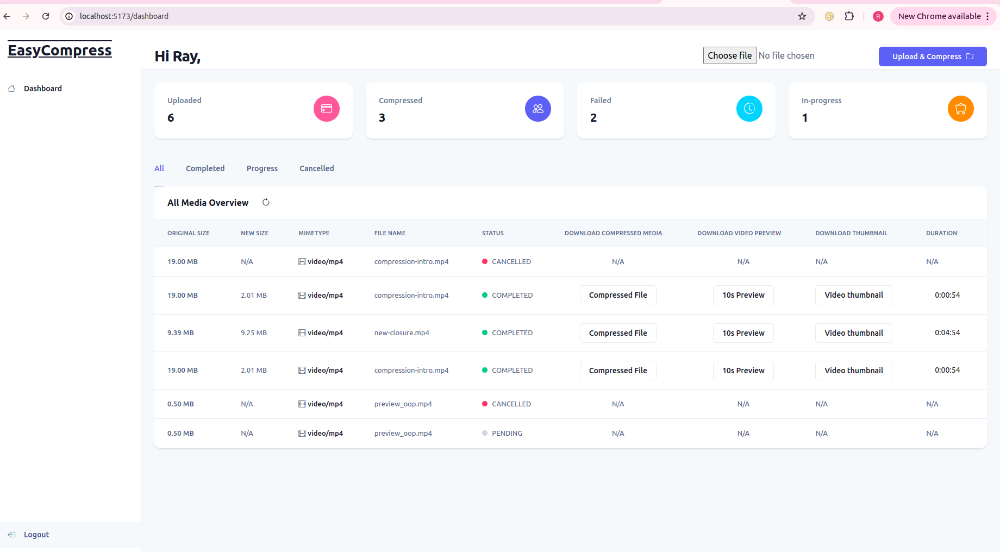
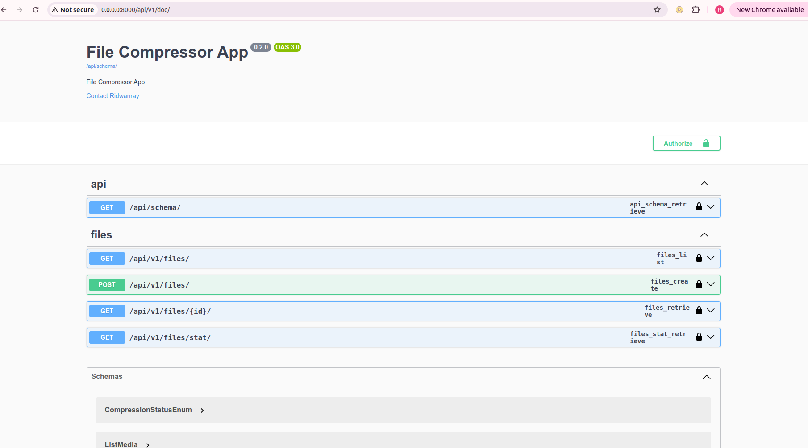
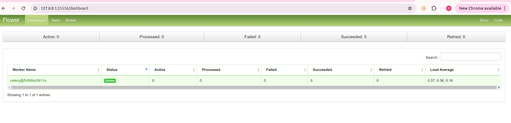

# Video & Audio Compressor App
This system compresses video & audio files submitted by a user

Check here: [FULL COURSE](https://youtu.be/siqDdrZI4x4?si=LA6zA9Yj4pn2EJJg) 

# Tools & Services:
- Django & DRF : for building the APIs
- Docker & Docker compose: Containerization
- Celery: For running background task asynchronously(e.g. video&audio compression)
- Rabbit MQ: A message broker for celery
- Flower dashboard: For monitoring celery background tasks
- PosgreSQL: Relational DB
- File Storage: AWS S3 Bucket
- VueJs: Frontend

# Running locally

Create a .env file by copying the .env.sample provided and run:

```
docker compose -f docker-compose.yml up --build
```
to build and run the container using the yaml file.

Access docs:
```sh
http://localhost:8000/api/v1/doc
```
## Frontend



## API




## Flower



## Despliegue en CapRover

Este proyecto está listo para desplegarse en CapRover. Sigue estos pasos:

1. Asegúrate de que el archivo `captain-definition` esté en la raíz del proyecto.
2. En la sección "App Configs > Environment Variables & Secrets" de CapRover, agrega las siguientes variables de entorno:
	- `SECRET_KEY`
	- `DATABASE_URL`
	- `RABBITMQ_URL`
	- `FLOWER_BASIC_AUTH`
	- `ALLOWED_HOSTS` (por ejemplo: `*`)
3. En tu máquina local, instala CapRover CLI:
	```sh
	npm install -g caprover
	```
4. Conéctate a tu servidor CapRover:
	```sh
	caprover login
	```
5. Despliega la aplicación:
	```sh
	caprover deploy
	```
